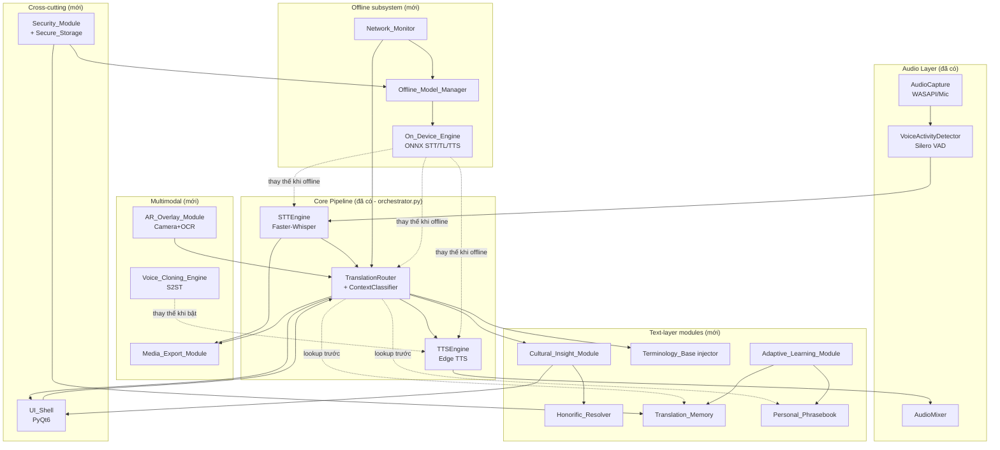
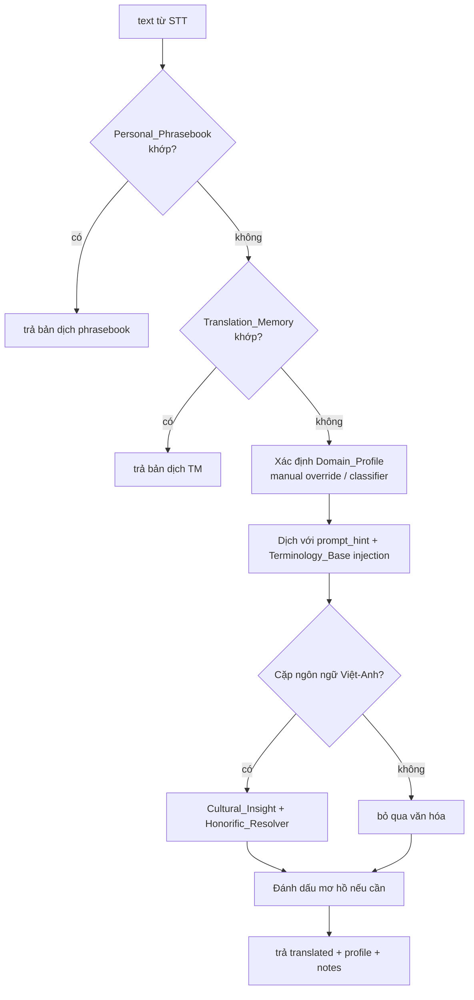
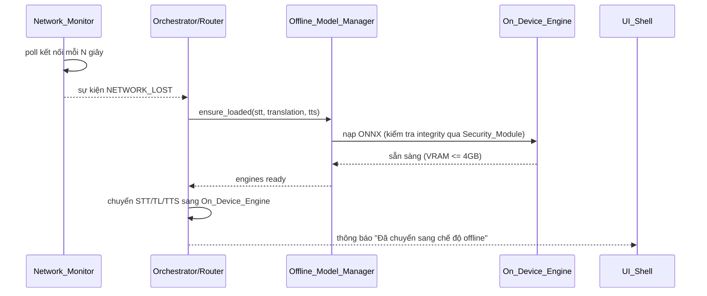

# Design Document

## Overview

**Smart Interpreter Engine** mở rộng pipeline realtime hiện có của **Han Translate** (`ai_interpreter/`) thành một phiên dịch viên AI có khả năng *hiểu ngữ cảnh, hiểu văn hóa, hoạt động ngoại tuyến, chuyên sâu theo lĩnh vực, thích ứng và đa phương thức*. Tài liệu này mô tả cách các module mới gắn vào kiến trúc multi-stage song song đã được triển khai trong `pipeline/orchestrator.py`, đồng thời tôn trọng các ràng buộc phần cứng (Windows 11, RTX 3050 4GB VRAM, Python 3.12).

Thiết kế bám sát **thứ tự ưu tiên theo tư vấn chuyên môn**:

1. **Capability A — Ngữ cảnh (ĐÃ TRIỂN KHAI).** `context/domain_profiles.py`, `context/classifier.py`, `context/router.py` đã chạy thực tế trong pipeline. Phần này được mô tả "as-built" và là nền tảng để các module khác cắm vào.
2. **Capability C — Văn hóa (THIẾT KẾ MỚI).** `Cultural_Insight_Module`, `Honorific_Resolver`, `Regional_Variant`.
3. **Capability F — Offline (THIẾT KẾ MỚI).** `Offline_Model_Manager`, `On_Device_Engine`, `Network_Monitor`.
4. **Capability B — Chuyên ngành sâu (THIẾT KẾ MỚI).** `Terminology_Base` injection tại tầng LLM, profile cài đặt thêm.
5. **Capability E + D — Adaptive + Multimodal (THIẾT KẾ MỚI).** `Adaptive_Learning_Module`, `Translation_Memory`, `Personal_Phrasebook`, `AR_Overlay_Module`, `Voice_Cloning_Engine`, `Media_Export_Module`.

Xuyên suốt tất cả các capability là bốn mối quan tâm cross-cutting: **độ trễ** (sub-3s, mục tiêu ~1.5s), **chất lượng UI/UX**, **bảo mật/quyền riêng tư** (`Security_Module`), và **vận hành ngoại tuyến**.

### Nguyên tắc thiết kế chủ đạo

- **Tôn trọng kiến trúc hiện có.** Mọi module mới gắn vào pipeline thông qua hai điểm mở rộng đã tồn tại: `TranslationRouter` (tầng văn bản) và các worker stage của `InterpreterPipeline` (tầng âm thanh/luồng). Không viết lại orchestrator.
- **Mỗi Domain_Profile là một cấu hình độc lập** — KHÔNG gộp thành một mô hình all-in-one (Req 2.7). Điều này đã được hiện thực trong `domain_profiles.py` và được giữ nguyên.
- **Local-first, offline-capable.** Các thành phần phải có đường suy biến (degradation path) khi mất mạng hoặc thiếu tài nguyên GPU.
- **Tách dữ liệu khỏi mã.** Dữ liệu văn hóa, thuật ngữ, bộ nhớ dịch, manifest mô hình nằm trong `Configuration_Store`/`Secure_Storage` để có thể chỉnh sửa, cài thêm và xóa theo yêu cầu người dùng.

## Architecture

### Kiến trúc tổng thể

Sơ đồ dưới đây cho thấy pipeline hiện có (nền xanh = ĐÃ CÓ) và các module mới (nền vàng = THIẾT KẾ MỚI) cắm vào đâu.



### Điểm mở rộng (Extension points)

Toàn bộ thiết kế dựa vào hai điểm tích hợp để giảm thiểu thay đổi orchestrator:

| Điểm mở rộng | Vị trí hiện tại | Module mới cắm vào |
|---|---|---|
| **Text enrichment** | `TranslationRouter.translate()` trong `context/router.py` | TM/PB lookup, Terminology injection, Cultural_Insight, Honorific resolution |
| **Engine swap** | Các worker `_stt_worker`, `_translation_worker`, `_tts_worker` trong `orchestrator.py` | On_Device_Engine (offline), Voice_Cloning_Engine (TTS) |
| **Session tap** | Callback `on_transcription`/`on_translation` của pipeline | Media_Export_Module thu thập transcript |
| **Network state** | (mới) một thread giám sát | Network_Monitor đẩy sự kiện online→offline |

`TranslationRouter` trở thành **trung tâm điều phối tầng văn bản**. Thứ tự xử lý mới trong `translate()` được mở rộng như sau:



> **Lưu ý về ưu tiên (Req 7.5):** Personal_Phrasebook được tra trước Translation_Memory, vì khi cùng một câu nguồn có cả hai mục thì Phrasebook thắng.

### Luồng chuyển đổi online → offline (Capability F)



### Mô hình luồng (threading model)

Giữ nguyên mô hình hiện có: mỗi stage một thread, nối nhau bằng `queue.Queue` có giới hạn (`maxsize=10`). Các bổ sung:

- **Network_Monitor** chạy trên một daemon thread riêng, poll trạng thái mạng và phát callback. Không nằm trong đường nóng (hot path) của câu dịch.
- **AR_Overlay_Module** chạy vòng lặp camera/OCR trên thread riêng (UI side), tách khỏi pipeline âm thanh để không ảnh hưởng độ trễ giọng nói.
- **Voice_Cloning_Engine** thay thế bước synthesize trong `_tts_worker`, dùng cùng cơ chế persistent event loop / GPU như `TTSEngine`.
- Tất cả truy cập GPU (STT, On_Device translation, Voice cloning) đi qua một **GpuResourceManager** (mutex + đếm VRAM) để tôn trọng ràng buộc 4GB (Req 8.7) và để fallback khi thiếu tài nguyên (Req 5.5).

## Components and Interfaces

### Capability A — Context (ĐÃ TRIỂN KHAI, mô tả as-built)

Các thành phần này đã chạy thực tế. Thiết kế ghi lại interface hiện có để các module khác phụ thuộc vào.

**`DomainProfile`** (`context/domain_profiles.py`) — dataclass cấu hình lĩnh vực độc lập với `id`, `name`, `keywords`, `style`, `prompt_hint`, `terminology`, `fast_mode`, `basic_vocab`. Registry `ALL_PROFILES` chứa 7 profile: `daily, travel, medical, legal, technical, fintech, business`. Hàm `get_profile(id)` fallback về `daily`.

**`ContextClassifier`** (`context/classifier.py`):

```python
class ContextClassifier:
    CONFIDENCE_THRESHOLD = 0.6   # Req 1.3
    WINDOW_SIZE = 5              # Context_Window (Req 1.7)
    def add_to_window(self, text: str) -> None
    def classify(self, text: str) -> Tuple[DomainProfile, float]   # Req 1.1, 1.2
    def reset(self) -> None
    @property
    def context_window(self) -> list
    @property
    def current_profile(self) -> DomainProfile
```

Điểm cốt lõi đã hiện thực: chấm điểm keyword *theo trọng số recency* trên Context_Window 5 câu, logic *sticky* để tránh nhảy domain liên tục, ngưỡng tin cậy 0.6, fallback `daily`.

**`TranslationRouter`** (`context/router.py`) — wrap quanh `TranslationEngine`:

```python
class TranslationRouter:
    def __init__(self, translation_engine, enable_context: bool = True)
    def set_manual_profile(self, profile_id: Optional[str]) -> None   # Req 1.4
    def translate(self, text: str, source_lang=None) -> Tuple[str, DomainProfile]
    def reset(self) -> None
    on_domain_change: Callable[[DomainProfile], None]                  # Req 1.5
    @property
    def current_profile(self) -> DomainProfile
```

**Mở rộng cần thực hiện trên Capability A (để khép kín requirements):**

- **Req 1.5 (badge ≤500ms kể cả khi không đổi):** callback `on_domain_change` đã được gọi *mỗi câu*. Cần đảm bảo UI cập nhật badge ngay cả khi profile không đổi — hiện `_notify_domain` đã luôn gọi callback; chỉ cần giữ hành vi này.
- **Req 1.8 / 1.9 (Implicit_Context + đánh dấu mơ hồ):** `translate()` sẽ trả thêm cờ `ambiguous` và lý do, để UI hiển thị cảnh báo. Đây là phần mở rộng kiểu trả về (xem Data Models → `TranslationResult`).
- **Req 1.6 (Travel = fast + basic_vocab):** profile `TRAVEL` đã đặt `fast_mode=True, basic_vocab=True`; cần router thực sự áp dụng (chọn nhánh dịch nhanh + post-process từ vựng cơ bản).

### Capability C — Cultural Insight (MỚI)

**`Cultural_Insight_Module`** — phát hiện thành ngữ/tiếng lóng, tạo `CulturalNote`, đề xuất diễn đạt tự nhiên, hỗ trợ `Regional_Variant`.

```python
class CulturalInsightModule:
    def __init__(self, db: CulturalDB, regional_variant: str = "neutral")
    def analyze(self, source_text: str, translated: str,
                lang_pair: tuple[str, str],
                context_window: list[str]) -> CulturalAnalysis
    def usage_examples(self, phrase: str, lang_pair: tuple[str,str]) -> list[UsageExample]  # Req 3.3
    def set_regional_variant(self, variant: Literal["bac","trung","nam","neutral"]) -> None  # Req 3.8
```

- `analyze()` chỉ tạo ghi chú khi `lang_pair` là Việt–Anh hoặc Anh–Việt (Req 3.4). Khi tìm thấy thành ngữ trong DB, sinh `CulturalNote` *và lưu lại* (Req 3.1 — lưu kể cả khi hiển thị tách biệt thất bại), đồng thời đề xuất ≥1 cách diễn đạt tự nhiên (Req 3.2).
- `CulturalAnalysis` trả về danh sách `notes`, danh sách `natural_suggestions`, và `regional_overrides` để router áp dụng từ vựng vùng miền (Req 3.8).
- `CulturalDB` là kho dữ liệu trong `Configuration_Store` (xem Data Models). Tra cứu bằng so khớp cụm từ chuẩn hóa (normalize lowercase + bỏ dấu tùy chọn).

**`Honorific_Resolver`** — chọn đại từ/xưng hô tiếng Việt khi dịch Anh→Việt.

```python
class HonorificResolver:
    def resolve(self, source_text: str, translated: str,
                context_window: list[str],
                session_overrides: dict) -> HonorificDecision   # Req 3.6
    # HonorificDecision.neutral_fallback = True khi thiếu thông tin (Req 3.7)
```

- Suy luận quan hệ/tuổi/vai vế từ `Context_Window`; nếu không đủ thông tin → chọn xưng hô trung lập và đặt cờ `needs_user_review = True` (Req 3.7).
- Khi người dùng sửa xưng hô, `Adaptive_Learning_Module.record_honorific_choice()` ghi nhớ trong phạm vi phiên để áp dụng cho câu tương tự (Req 3.9). `session_overrides` được truyền vào `resolve()` ở các câu sau.

**Tích hợp:** `Cultural_Insight_Module` và `Honorific_Resolver` được gọi *sau* khi có bản dịch thô trong `TranslationRouter.translate()`, chỉ khi cặp ngôn ngữ thỏa điều kiện. Ghi chú văn hóa được trả qua `TranslationResult.cultural_notes` và phát lên UI tách biệt với bản dịch chính (Req 3.5).

### Capability F — Offline subsystem (MỚI)

**`Network_Monitor`**

```python
class NetworkMonitor:
    def start(self) -> None
    def stop(self) -> None
    def is_online(self) -> bool
    on_status_change: Callable[[bool], None]   # True=online, False=offline
```

Poll bằng socket/HEAD request nhẹ tới một endpoint ổn định với timeout ngắn; debounce để tránh nhấp nháy. Khi phát hiện *mất mạng trong lúc đang dùng engine online* → phát `on_status_change(False)` để orchestrator chuyển sang On_Device_Engine (Req 8.3).

**`Offline_Model_Manager`**

```python
class OfflineModelManager:
    def __init__(self, manifest_store: ModelManifestStore, security: SecurityModule)
    def ensure_loaded(self, kind: Literal["stt","translation","tts"]) -> OnDeviceModel  # Req 8.4
    def load_model(self, manifest: ModelManifest) -> OnDeviceModel
    def unload(self, kind: str) -> None
    def vram_budget_ok(self, manifest: ModelManifest) -> bool   # Req 8.7
```

- Hỗ trợ nạp ONNX cho STT/translation/TTS (Req 8.4). Trước khi nạp, gọi `SecurityModule.verify_integrity()` (Req 11.3); nếu thất bại → từ chối nạp, không ngoại lệ, giữ engine ở trạng thái trước (Req 8.6, 11.4).
- Quản lý ngân sách VRAM: trước khi nạp, kiểm tra tổng VRAM dự kiến ≤ 4GB qua `GpuResourceManager`; nếu vượt → nạp biến thể lượng tử hóa (int8) hoặc unload bớt model (Req 8.7).

**`On_Device_Engine`** — adapter implement cùng interface với `STTEngine`, `TranslationEngine`, `TTSEngine` để cắm thẳng vào worker:

```python
class OnDeviceSTT:  def transcribe(self, audio) -> tuple[str,str]
class OnDeviceTranslator: def translate(self, text, source_lang=None) -> str
class OnDeviceTTS: def synthesize(self, text) -> np.ndarray
```

Dùng CUDA execution provider của ONNX Runtime khi GPU khả dụng (Req 8.5), ngược lại CPU provider.

**Tích hợp:** orchestrator giữ tham chiếu tới *engine hiện hành* cho mỗi stage. Khi offline bật (thủ công hoặc auto), các tham chiếu được thay bằng `On_Device_*`. Ở chế độ offline, `TranslationRouter`/pipeline tuyệt đối không gọi dịch vụ mạng (Req 8.2, 11.5).

### Capability B — Domain depth (MỚI)

**Terminology injection tại tầng LLM.** Hiện `router._apply_terminology()` là placeholder (hậu xử lý chưa hoạt động). Thiết kế mới chuyển terminology vào *prompt* khi dùng engine LLM, và dùng hậu xử lý an toàn cho engine không-LLM:

```python
class TerminologyInjector:
    def build_prompt_glossary(self, profile: DomainProfile) -> str       # cho LLM
    def post_process(self, translated: str, profile: DomainProfile) -> str  # cho non-LLM
    def lookup(self, term: str, profile: DomainProfile) -> Optional[str]    # Req 2.2, 2.5
```

- Nếu thuật ngữ có trong `Terminology_Base` của profile → dùng bản chuẩn (Req 2.2); nếu không → để engine chung dịch (Req 2.5).
- Medical/Legal áp bộ thuật ngữ chuẩn kể cả khi không phát hiện thuật ngữ nào (Req 2.3, 2.4) thông qua `prompt_hint` + glossary luôn được đính kèm khi profile đang hoạt động.

**Terminology editing & installable profiles.**

```python
class TerminologyStore:
    def list(self, profile_id: str) -> list[TerminologyEntry]
    def upsert(self, profile_id: str, entry: TerminologyEntry) -> None  # Req 2.6
    def delete(self, profile_id: str, source_term: str) -> None         # Req 2.6

class DomainProfileInstaller:
    def install(self, package_path: str) -> DomainProfile   # Req 2.8 (không sửa profile khác)
    def uninstall(self, profile_id: str) -> None
```

Profile cài thêm được nạp vào `ALL_PROFILES` runtime mà không yêu cầu thay đổi profile hiện có (Req 2.7, 2.8). Mỗi profile vẫn là cấu hình độc lập (không all-in-one).

### Capability E — Adaptive learning (MỚI)

```python
class AdaptiveLearningModule:
    def __init__(self, tm: TranslationMemory, pb: PersonalPhrasebook)
    def record_correction(self, source: str, corrected_target: str,
                          lang_pair: tuple[str,str]) -> None     # Req 7.1
    def record_honorific_choice(self, pattern, choice) -> None    # Req 3.9 (phạm vi phiên)

class TranslationMemory:
    def add(self, entry: TranslationMemoryEntry) -> None          # Req 7.1 (luôn thêm)
    def lookup(self, source: str, lang_pair) -> Optional[TranslationMemoryEntry]  # Req 7.2
    def all(self) -> list[TranslationMemoryEntry]
    def clear(self) -> None                                       # Req 11.6

class PersonalPhrasebook:
    def add(self, entry: PhrasebookEntry) -> None
    def update(self, entry: PhrasebookEntry) -> None              # Req 7.3
    def delete(self, source_phrase: str) -> None
    def lookup(self, source: str, lang_pair) -> Optional[PhrasebookEntry]  # Req 7.4
    def clear(self) -> None                                       # Req 11.6
```

- Khi người dùng sửa bản dịch → thêm mục mới vào TM bất kể nội dung hiện có (Req 7.1).
- Router tra TM/PB *trước* khi gọi model (Req 7.2); PB ưu tiên hơn TM khi mâu thuẫn (Req 7.5); mục PB mới có hiệu lực trong ≤1s (Req 7.4) nhờ lưu in-memory + persist nền.
- TM và PB persist xuống đĩa (JSON) với thuộc tính round-trip (Req 7.6) — xem Correctness Properties.

### Capability D — Multimodal (MỚI)

**`AR_Overlay_Module`**

```python
class AROverlayModule:
    def start(self, camera_index: int = 0) -> None
    def stop(self) -> None
    def process_frame(self, frame) -> ARFrameResult   # OCR + dịch + box
    on_frame: Callable[[ARFrameResult], None]
    target_fps: int = 5   # Req 4.3
```

- OCR khung hình (Req 4.1), dịch text qua `TranslationRouter`, hiển thị overlay tại vị trí text gốc (Req 4.2). Luôn cập nhật hiển thị ≥5 fps kể cả khi không có overlay (Req 4.3). Không có text → hiện khung hình không overlay (Req 4.4). Mất camera/từ chối quyền → giữ khung hình gần nhất + báo lỗi (Req 4.5).

**`Voice_Cloning_Engine`** (S2ST)

```python
class VoiceCloningEngine:
    def is_sample_sufficient(self) -> bool                 # Req 5.3
    def synthesize(self, text: str, speaker_ref) -> np.ndarray  # Req 5.1, sub-3s (Req 5.2)
    def feed_reference(self, audio_segment) -> None
```

- Khi bật và đủ mẫu giọng → tổng hợp giữ đặc trưng giọng gốc (Req 5.1) với End_To_End_Latency ≤3s (Req 5.2). Chưa đủ mẫu → vẫn bật engine nhưng dùng giọng TTS mặc định (Req 5.3). Tắt → dùng TTSEngine tiêu chuẩn (Req 5.4). Thiếu GPU → fallback TTS chuẩn + ghi log sự kiện chuyển đổi (Req 5.5).

**`Media_Export_Module`**

```python
class MediaExportModule:
    def record_segment(self, src: str, tgt: str, t_start: float, t_end: float) -> None
    def export_transcript(self, fmt: Literal["txt","srt"]) -> str   # Req 6.1, 6.3
    def export_audio(self) -> bytes                                  # Req 6.2
    def parse_srt(self, srt_text: str) -> Transcript                 # cho round-trip
    def has_content(self) -> bool                                    # Req 6.5
```

- Thu thập từng câu (gốc + dịch + timestamp) qua session tap. Xuất transcript dạng `txt` và `srt` (Req 6.1, 6.3); xuất audio dịch toàn phiên (Req 6.2). Không có câu nào → báo "không có nội dung" (Req 6.5). SRT export→parse có thuộc tính round-trip (Req 6.4).

### Cross-cutting — Security_Module (MỚI)

```python
class SecurityModule:
    def store_secret(self, key: str, value: str) -> None     # mã hóa (Req 11.1)
    def get_secret(self, key: str) -> Optional[str]
    def redact_for_log(self, message: str) -> str            # Req 11.2
    def verify_integrity(self, model_path: str, manifest: ModelManifest) -> bool  # Req 11.3/11.4
    def delete_user_data(self) -> None                       # Req 11.6
```

- `Secure_Storage` mã hóa khóa API/credential trên đĩa (Req 11.1). Logger được gắn filter `redact_for_log` để không ghi secret/nội dung người dùng dạng plaintext (Req 11.2).
- Xác minh tính toàn vẹn model bằng hash (SHA-256) trong manifest trước khi nạp; sai hash → từ chối nạp + báo người dùng (Req 11.3, 11.4).
- Xóa dữ liệu cá nhân: xóa TM, PB, các mục Secure_Storage theo yêu cầu (Req 11.6). Quy trình build installer không nhúng credential nhà phát triển (Req 11.7 — kiểm tra ở tầng đóng gói/CI).

### Cross-cutting — UI_Shell (mở rộng PyQt6 hiện có)

`app.py` đã có: tray, start/stop, combo domain, domain badge có màu, hiển thị transcript/translation. Mở rộng cần thêm:

- Bảng trạng thái: Domain_Profile + cặp ngôn ngữ + trạng thái online/offline (Req 10.2).
- Subtitle overlay tùy biến vị trí/cỡ chữ/màu (Req 10.4, 10.5).
- Khu vực ghi chú văn hóa tách biệt + cảnh báo câu mơ hồ (Req 3.5, 1.9).
- Quản lý Terminology_Base/Phrasebook, nút xóa dữ liệu cá nhân, cảnh báo lỗi bằng ngôn ngữ người dùng (Req 10.6).
- Phản ánh thay đổi cấu hình trong ≤500ms (Req 10.3).

## Data Models

Tất cả model dùng `@dataclass` (đồng bộ phong cách `domain_profiles.py`). Các model có persistence đều hỗ trợ `to_dict()/from_dict()` để round-trip JSON.

### DomainProfile (đã có — giữ nguyên)

```python
@dataclass
class DomainProfile:
    id: str
    name: str
    keywords: List[str] = field(default_factory=list)
    style: str = "neutral"
    prompt_hint: str = ""
    terminology: Dict[str, str] = field(default_factory=dict)
    fast_mode: bool = False
    basic_vocab: bool = False
```

### TerminologyEntry (mới)

```python
@dataclass
class TerminologyEntry:
    profile_id: str
    source_term: str
    target_term: str
    source_lang: str = "en"
    target_lang: str = "vi"
    note: str = ""
    user_defined: bool = False   # phân biệt mục do người dùng thêm
```

### CulturalNote & UsageExample (mới)

```python
@dataclass
class CulturalNote:
    phrase: str                  # thành ngữ/tiếng lóng gốc
    literal_translation: str     # bản dịch sát nghĩa
    meaning: str                 # giải thích văn hóa
    natural_suggestions: List[str] = field(default_factory=list)  # Req 3.2 (>=1)
    lang_pair: Tuple[str, str] = ("en", "vi")
    examples: List["UsageExample"] = field(default_factory=list)

@dataclass
class UsageExample:
    text: str
    translation: str             # Req 3.3 (ví dụ kèm bản dịch)
```

### HonorificRule & HonorificDecision (mới)

```python
@dataclass
class HonorificRule:
    english_pronoun: str         # "you","he","she"...
    vietnamese_options: List[str]  # ["anh","chị","em","ông","bà","cháu"...]
    condition: str               # mô tả điều kiện (tuổi/vai vế/quan hệ)

@dataclass
class HonorificDecision:
    chosen: str
    neutral_fallback: bool = False   # Req 3.7
    needs_user_review: bool = False
    rationale: str = ""
```

### TranslationMemoryEntry (mới)

```python
@dataclass
class TranslationMemoryEntry:
    source: str
    target: str
    source_lang: str
    target_lang: str
    created_at: float            # epoch seconds
    domain_id: str = "daily"
```

### PhrasebookEntry (mới)

```python
@dataclass
class PhrasebookEntry:
    source_phrase: str
    target_phrase: str
    source_lang: str
    target_lang: str
    note: str = ""
```

### TranslationResult (mới — mở rộng giá trị trả về của Router)

```python
@dataclass
class TranslationResult:
    translated: str
    profile: DomainProfile
    source: str
    ambiguous: bool = False                # Req 1.9
    ambiguity_reason: str = ""
    cultural_notes: List[CulturalNote] = field(default_factory=list)
    honorific: Optional[HonorificDecision] = None
    used_memory: bool = False              # TM/PB hit
```

> Để không phá vỡ chữ ký `translate() -> Tuple[str, DomainProfile]` mà orchestrator đang dùng, `TranslationResult` được phơi qua một phương thức mới `translate_rich()`; phương thức `translate()` cũ giữ nguyên (bao bọc `translate_rich`) để tương thích ngược.

### Transcript & TranscriptSegment (mới — cho Media_Export)

```python
@dataclass
class TranscriptSegment:
    index: int
    source_text: str
    target_text: str
    t_start: float               # giây
    t_end: float

@dataclass
class Transcript:
    segments: List[TranscriptSegment] = field(default_factory=list)
```

Định dạng SRT chuẩn: chỉ số, mốc `HH:MM:SS,mmm --> HH:MM:SS,mmm`, nội dung. Round-trip (Req 6.4) so khớp trên tập `TranscriptSegment` sau khi chuẩn hóa thời gian về mili-giây.

### ModelManifest (mới — cho Offline & Security)

```python
@dataclass
class ModelManifest:
    name: str
    kind: Literal["stt", "translation", "tts"]
    path: str
    format: Literal["onnx"]      # Req 8.4
    sha256: str                  # integrity (Req 11.3)
    vram_mb: int                 # ước lượng VRAM để giữ ngân sách 4GB (Req 8.7)
    quantization: str = "fp16"   # fp16/int8
    execution_provider: str = "cuda"  # cuda/cpu (Req 8.5)
```

### Cấu trúc lưu trữ (Configuration_Store / Secure_Storage)

```
%APPDATA%/HanTranslate/
├── config.json                 # cấu hình ứng dụng
├── profiles/                   # Domain_Profile cài thêm (Req 2.8)
│   └── <profile_id>.json
├── terminology/                # Terminology_Base có thể chỉnh sửa (Req 2.6)
│   └── <profile_id>.json
├── cultural/                   # CulturalDB (idiom/slang/regional)
│   ├── idioms.json
│   ├── honorifics.json
│   └── regional.json
├── memory/
│   ├── translation_memory.json # TM (Req 7.6 round-trip)
│   └── phrasebook.json         # PB
├── models/
│   └── manifests.json          # ModelManifest list
└── secure/                     # Secure_Storage (đã mã hóa, Req 11.1)
    └── secrets.enc
```
