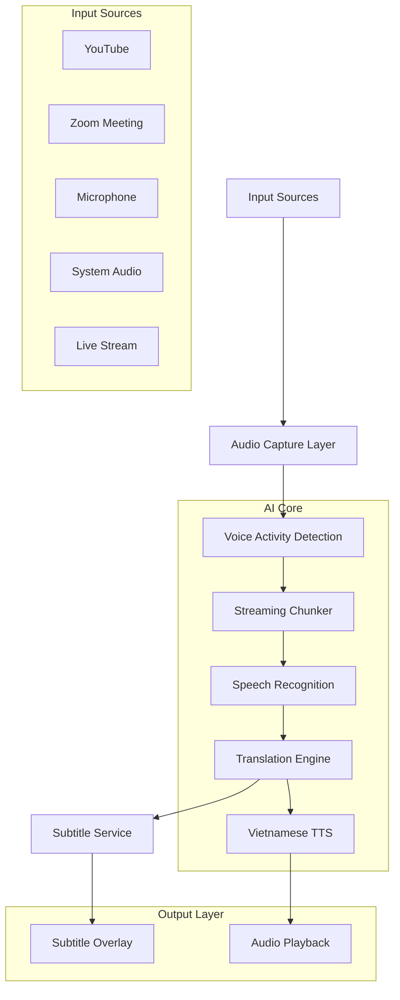
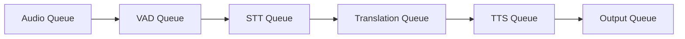
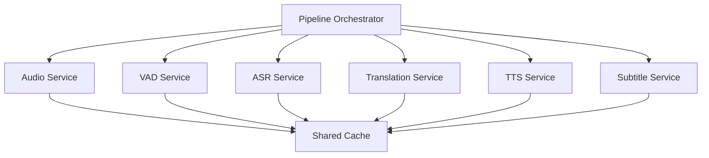
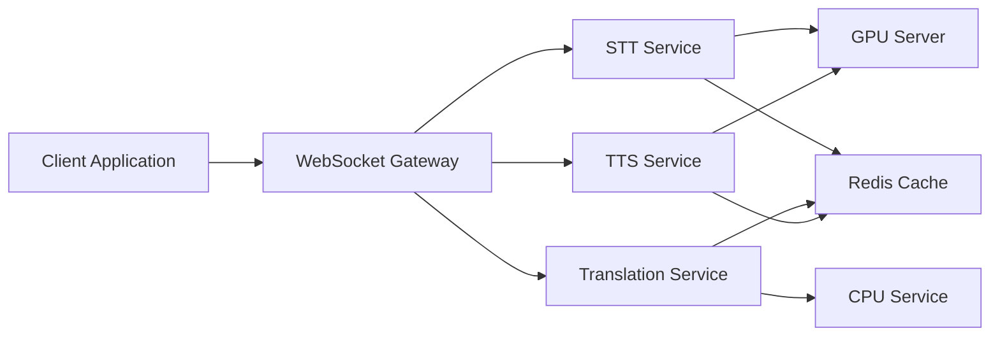

# AI Realtime Translator & Vietnamese Dubbing System

## Overview

This system is designed to provide:

- Real-time speech recognition
- Real-time translation
- Vietnamese AI voice dubbing
- Live subtitle rendering
- Low latency streaming pipeline

The architecture is optimized for:

- Applied AI Engineering
- Real-time audio processing
- GPU inference
- Streaming systems
- Multi-service orchestration

---

# 1. High-Level Architecture



---

# 2. Streaming Pipeline



---

# 3. System Components

## 3.1 Audio Capture Layer

Responsibilities:

- Capture microphone audio
- Capture system audio
- Normalize audio stream
- Format conversion
- Streaming input handling

Technologies:

- FFmpeg
- SoundDevice
- PyAudio

Input:

- Microphone
- System Audio
- Video Streams
- Live Meetings

Output:

- PCM audio chunks

---

## 3.2 Voice Activity Detection (VAD)

Responsibilities:

- Detect human speech
- Remove silence
- Filter background noise
- Reduce unnecessary inference

Recommended Engine:

- Silero VAD

Benefits:

- Lower latency
- Lower GPU usage
- Better transcription quality

---

## 3.3 Streaming Chunker

Responsibilities:

- Adaptive chunk segmentation
- Silence-aware chunking
- Overlap handling
- Streaming optimization

Features:

- Dynamic chunk size
- Smart segmentation
- Real-time buffering

Output:

- Speech segments ready for STT

---

## 3.4 Speech Recognition Layer

Responsibilities:

- Speech-to-text
- Streaming transcription
- GPU inference
- Multilingual recognition

Recommended Engine:

- Faster-Whisper

Inference Options:

- FP16
- INT8
- CUDA acceleration

GPU Recommendation:

- RTX 3050 or higher

Output:

- Real-time transcript

---

## 3.5 Translation Engine

Responsibilities:

- Language translation
- Context-aware translation
- Streaming translation
- Language routing

Possible Engines:

- NLLB
- MarianMT
- GPT Translation
- Google Translate API

Recommended Strategy:

- Local-first translation
- Cloud fallback

Output:

- Vietnamese translated text

---

## 3.6 Vietnamese TTS Layer

Responsibilities:

- Generate Vietnamese voice
- Real-time speech synthesis
- Streaming audio playback
- Voice cloning (optional)

Recommended Engines:

- XTTS v2
- Piper TTS
- FPT AI TTS

Advanced Features:

- Emotion synthesis
- Voice cloning
- Personalized voice

Output:

- Vietnamese AI speech

---

## 3.7 Subtitle Service

Responsibilities:

- Render subtitles
- Realtime caption overlay
- Subtitle synchronization
- Export subtitle files

Export Formats:

- SRT
- VTT
- TXT
- JSON

---

## 3.8 Presentation Layer

Responsibilities:

- Desktop UI
- OBS overlay
- Web interface
- Live caption rendering

Frontend Options:

- Electron
- React
- Next.js
- OBS Browser Source

---

# 4. Orchestration Layer



Responsibilities:

- Manage pipeline state
- Retry failed services
- Health checks
- Queue management
- Auto recovery
- Dynamic routing

Recommended Technologies:

- AsyncIO
- Redis Queue
- WebSocket
- FastAPI

---

# 5. Deployment Architecture



---

# 6. Recommended Folder Structure

```text
app/
│
├── audio/
│   ├── capture.py
│   ├── vad.py
│   ├── chunker.py
│   └── normalizer.py
│
├── stt/
│   ├── whisper_engine.py
│   ├── streaming_asr.py
│   └── model_manager.py
│
├── translation/
│   ├── translator.py
│   ├── language_router.py
│   └── context_manager.py
│
├── tts/
│   ├── vietnamese_tts.py
│   ├── voice_clone.py
│   └── audio_streamer.py
│
├── subtitle/
│   ├── renderer.py
│   ├── overlay.py
│   └── exporter.py
│
├── websocket/
│   ├── gateway.py
│   └── realtime_stream.py
│
├── services/
│   ├── pipeline_service.py
│   ├── orchestrator.py
│   └── health_monitor.py
│
├── ui/
│   ├── desktop/
│   └── web/
│
├── config/
│   ├── settings.yaml
│   └── env.py
│
└── main.py
```

---

# 7. YAML Architecture Spec

```yaml
system:
  name: AI Realtime Translator
  mode: streaming
  target_language: vietnamese

services:

  audio_capture:
    technologies:
      - ffmpeg
      - sounddevice
    responsibilities:
      - capture_audio
      - normalize_audio
      - stream_audio

  vad:
    engine: silero-vad
    responsibilities:
      - detect_speech
      - remove_silence

  stt:
    engine: faster-whisper
    gpu: true
    precision: fp16

  translation:
    engine: nllb
    fallback:
      - gpt_translation

  tts:
    engine: xtts-v2
    voice: vietnamese

  subtitle:
    formats:
      - srt
      - vtt
      - txt

pipeline:
  - audio_capture
  - vad
  - stt
  - translation
  - subtitle
  - tts
```

---

# 8. Performance Targets

| Component | Target Latency |
|---|---|
| Audio Capture | < 50ms |
| VAD | < 100ms |
| STT | 300-800ms |
| Translation | < 200ms |
| TTS | 300-700ms |
| Total Pipeline | 1-2 seconds |

---

# 9. Future Upgrades

## AI Meeting Assistant

Features:

- Meeting summary
- Action item extraction
- Speaker diarization
- Emotion analysis

---

## AI Voice Cloning

Features:

- Clone original speaker tone
- Vietnamese multilingual dubbing
- Personalized voice generation

---

## Multi-Agent AI Pipeline

Agents:

- Transcription Agent
- Translation Agent
- Summarization Agent
- QA Agent
- Report Generator Agent

---

# 10. Recommended Tech Stack

| Layer | Recommended Tech |
|---|---|
| Audio | FFmpeg + SoundDevice |
| VAD | Silero VAD |
| STT | Faster-Whisper |
| Translation | NLLB / MarianMT |
| TTS | XTTS v2 / Piper |
| Backend | FastAPI |
| Streaming | WebSocket |
| Queue | Redis |
| Frontend | React / Electron |
| Deployment | Docker |

---

# 11. Engineering Goals

This project is designed to teach and demonstrate:

- AI Systems Engineering
- Real-time AI pipelines
- GPU inference optimization
- Streaming architecture
- Speech AI systems
- Multimodal AI engineering
- Production AI deployment
- Applied AI product development

